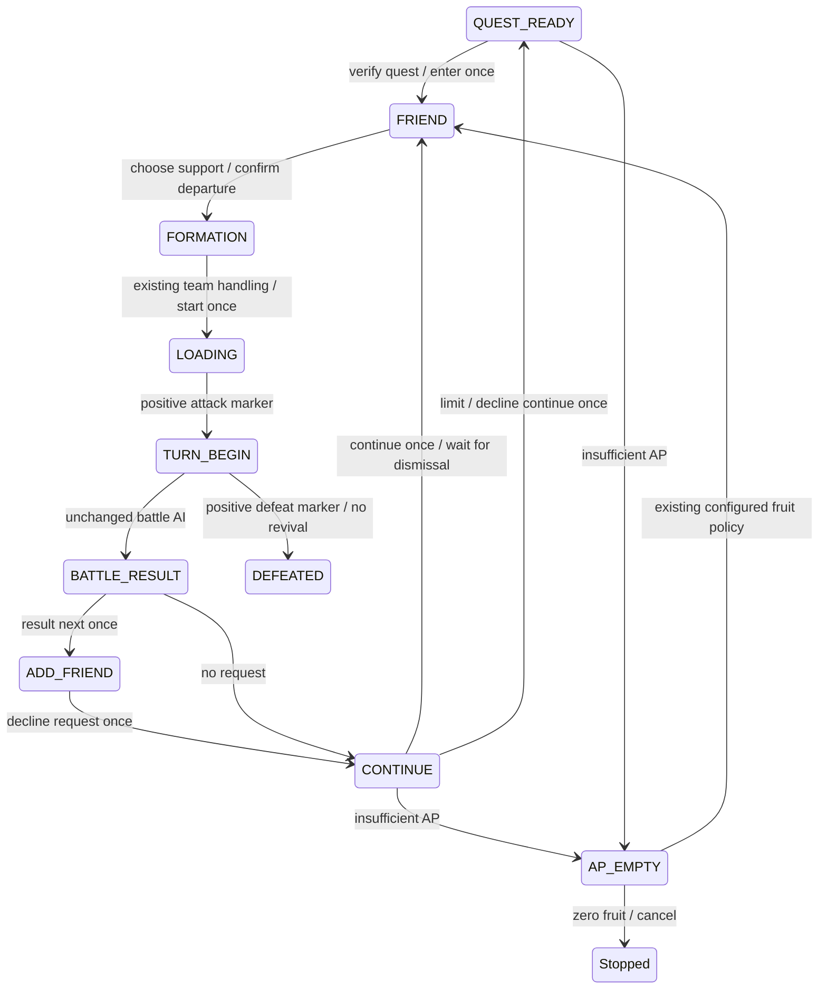

# Battle cycle state machine

This document describes `fix/battle-cycle-state-machine`, based on `add17a8a58f0315e91b695b25693c42431a61424`. It has not been merged into `cn-dev`. Offline tests validate simulated transitions; live results are tracked separately. P0 remains open until the ten-battle stage passes.

## Entry and settlement

The common `BattleCycle.prepare` handles both entry routes. `chooseFriend` selects a support and returns a `FriendSelectionResult` only after confirming FORMATION. It cannot imply that a battle has started. The CN first-selection input uses the verified first card's blue body at 1280x720 `(650,300)`; the old header input `(845,203)` could be ignored. Template and first/prefer/strict policies remain intact.

## States and evidence

| State | Positive proof / use |
|---|---|
| QUEST_READY | existing main-interface marker plus CN quest verification before input |
| AP_EMPTY | existing AP dialog marker; unchanged configured fruit policy |
| FRIEND / FRIEND_EMPTY | existing CN support/no-support predicates |
| FORMATION | existing begin-task button marker |
| LOADING | dark frame or injected loading predicate; authorizes waiting only |
| TURN_BEGIN | existing attack marker; only then increment startedBattles |
| BATTLE_RESULT | existing result marker; no item recognition |
| ADD_FRIEND / CONTINUE | existing foreground dialog predicates |
| DEFEATED | existing defeat predicate; no revival input |
| NETWORK_ERROR | existing dialog predicate; worker confirms once |
| SPECIAL_MODAL | existing special modal predicate; existing stop policy |
| SKILL_CAST_FAILED | existing skill error predicate; recover once during skill wait |
| UNKNOWN | all known positive detectors false; wait within deadline |
| AMBIGUOUS | conflicting foreground states; stop before input |

Foreground priority is explicit and included in evidence: NETWORK_ERROR, CONTINUE, AP_EMPTY, ADD_FRIEND, DEFEATED, SKILL_CAST_FAILED, SPECIAL_MODAL, FRIEND_EMPTY. A positive CONTINUE cannot be swallowed by FRIEND or the historical SKILLERROR overlap. Conflicting remaining strong states stop. The region-specific CN continuous-dialog patch is retained.

## Time bounds

STARTING was removed on 2026-10-04: no real producer was established. No start confirmation is assumed. The original 90-second bound and ATTACK .05 threshold remain unchanged pending real evidence. The input observer now spans preparation, battle and settlement, recording logical actions and physical inputs separately.

Only verified FORMATION plus recorded start_quest opens the narrow TURN_BEGIN transition capture: first/middle/last UNKNOWN and one LOADING representative, local only. Other UNKNOWN screens remain excluded. Metadata includes acquisition monotonic times, signature, brightness, ATTACK score, state and exact/approximate frame equality. Completion or failure persists the diagnostic episode. Raw private captures are never test fixtures or CI artifacts.

All state polling uses `time.monotonic`, stop/suspend checks, fresh screenshots and a 0.2-second scheduled pause. State changes/actions/errors log to the ordinary logger and GUI log, not every poll.

| Phase | Limit |
|---|---:|
| Quest / continue dismissal | 45 s |
| Support selection departure | 30 s |
| Support overall acquisition | 180 s; existing navigation/refresh guards also apply |
| Team switch | 10 s |
| Formation start to TURN_BEGIN | 90 s |
| Skill/master animation | 45 s, capped by remaining whole-battle deadline |
| Battle without valid progress | 60 s |
| Whole battle | 1800 s |
| Result transition | 30 s |
| Friend request / special modal close | 20 s |
| Overall settlement | 60 s |
| Final decline-continue return | 30 s |
| GUI shutdown join | 5 s; refuse close if still alive |

Fuse remains unchanged as the last insurance for legacy Detect/AI calls. Detector count/template matches are not elapsed time. The new flow does not rely on Fuse for deadlines. Individual device I/O itself is not forcibly interrupted: a stuck device operation can outlast a phase deadline until it returns, and GUI close explicitly refuses rather than killing a Python thread.

## Counters and compatibility

`startedBattles` increases only after TURN_BEGIN proof. `completedAttempts` increases on a terminal victory/defeat. `wins + defeats == completedAttempts <= startedBattles`. An interrupted in-progress battle is started but not completed. Pre-start failure increases none. A confirmed terminal result still counts if subsequent settlement fails.

`Main.result.battle` now means `completedAttempts`; `defeated` aliases `defeats`. `turnPerBattle` and `timePerBattle` average wins only. Explicit new fields coexist with the old API. Kernel Operation and GuiQueueOperation deduct only completed attempts, and preserve started-but-incomplete counts separately. CLI result display and GUI queue use the same semantics. Legacy/custom runners without explicit wins retain a documented completed-minus-defeated fallback.

A run limit/appointment takes effect after settlement at a stable CONTINUE/QUEST_READY boundary, declines further continuation, and completes with `Done`. Defeat is recorded and stops without revival. Fruit/AP policy is otherwise unchanged; zero fruit cancels AP recovery normally and never selects quartz.

## Input ownership and GUI lifecycle

`AutomationOwner` is reentrant within one thread and refuses another owner. Kernel serialized operations, GUI queue navigation and the GUI worker acquire it. The GUI worker retains ownership through global scheduler cleanup. Guardian only publishes NETWORK_ERROR_EVENT; the owner rechecks the page and sends one confirmation at a bounded wait/navigation safe point. Guardian never presses, touches or performs.

`_runActive` is set before creating/starting the worker. Duplicate starts are ignored immediately, creation failures clear it, and completion clears it. Quit requests stop, joins for five seconds, then refuses if device I/O is still pending. No thread termination or APK/network changes.

## Trace and local diagnostics

`fgoFlowTrace.py` is Qt-free. Records contain wall/monotonic timestamps, from/to, elapsed, action, evidence, last input and intended battle sequence. An optional per-thread Device observer records physical press/touch/swipe during Battle and checks the whole-battle deadline before forwarding input; Android is unchanged. The trace sequence labels preparation; the actual started counter still waits for TURN_BEGIN.

Only two screenshots are held in memory. Failure writes `logs/flow/<timestamp>/trace.json`, `summary.txt`, and last/previous frame only for a positively classified safe game state. Unknown/login-sensitive frames and support identifiers are omitted. Successful validation traces are retained separately by the private local harness. Logs/screenshots/configuration/support templates never belong in Git.

## Tests and scope

`test_battle_cycle.py` exercises real Main/Cycle with deterministic clocks, frames and ordered input effects. Tests cover initial/repeat formation, delayed support/formation/loading, stuck continue/formation, unknown/timeouts, network, friend request, zero fruit, appointments, defeat, started/completed invariants and trace ordering. Other suites exercise skill bounds, owner/guardian/GUI lifecycle and queue semantics. `test_core_waits.py` documents bounded and lifecycle loop allowances using AST.

Removed: repeat sleep(6), ten blind result spaces, four skill busy waits, unbounded Battle loop, guardian device input, delayed GUI double-start protection and unlimited join. Existing AI card selection and skill strategy are preserved; no new daily/event/formation/drop features are introduced. Optional farming/guardian daemons retain explicit stop flags and scheduled waits. User-configured unlimited Main/queue plans remain possible, with bounded phase waits.

## Live validation status (2026-10-03)

Single stage incomplete: normalization refusal and support-departure timeout were recorded; the support input was corrected with an evidence-based regression. The next entry timed out at FORMATION -> TURN_BEGIN after 90.20 seconds. Subsequent read-only sampling found the existing attack template valid, but it cannot prove what was displayed during the failed interval. No threshold/time-limit relaxation was made. An unfinished battle remains in the client; no AI turn or settlement was run by this branch. Five/ten stages have not started. P0 remains open. Private reports contain exact traces and local artifact paths; these are not uploaded.
