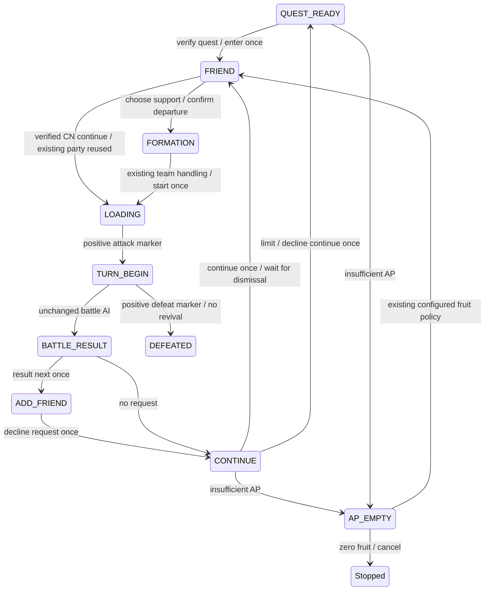

# Battle cycle state machine

This document describes `fix/battle-cycle-state-machine`, based on `add17a8a58f0315e91b695b25693c42431a61424`. The battle-cycle state machine was merged into `cn-dev` by fast-forward to `5e6b212c6b28f801f9836f80b5bebb4f68a47fea`; `master` is unchanged. P0: **mitigated / awaiting longer-term observation**, not proven permanently fixed. The latest approved code HEAD has passed the complete live gate recorded below; earlier open/timeout statements are historical and superseded.

## Entry and settlement

The common `BattleCycle.prepare` handles both entry routes. Initial support selection confirms FORMATION. The observed CN CONTINUE route can instead reuse the existing party: selecting support loads directly into TURN_BEGIN. Only a previously confirmed CONTINUE action enables this alternate exit, and `FriendSelectionResult.state` reports the actual observed exit. Positive TURN_BEGIN is required before AI and counting; it never sends another start input. The CN first-selection input uses the verified first card's blue body at 1280x720 `(650,300)`; the old header input `(845,203)` could be ignored. Template and first/prefer/strict policies remain intact.

## States and evidence

| State | Positive proof / use |
|---|---|
| QUEST_READY | existing main-interface marker plus CN quest verification before input |
| AP_EMPTY | existing AP dialog marker; unchanged configured fruit policy |
| FRIEND / FRIEND_EMPTY | existing CN support/no-support predicates |
| FORMATION | existing begin-task button marker |
| LOADING | dark frame or CN fixed tips/loading labels; authorizes waiting only |
| TURN_BEGIN | existing attack marker; only then increment startedBattles |
| BATTLE_RESULT | existing reward marker or CN fixed Bond/Master EXP result labels and footer; no item recognition |
| ADD_FRIEND / CONTINUE | existing foreground dialog predicates |
| DEFEATED | existing defeat predicate; no revival input |
| NETWORK_ERROR | existing dialog predicate; worker confirms once |
| SPECIAL_MODAL | existing special modal predicate; existing stop policy |
| SKILL_CAST_FAILED | existing skill error predicate; recover once during skill wait |
| UNKNOWN | all known positive detectors false; wait within deadline |
| AMBIGUOUS | conflicting foreground states; stop before input |

Foreground priority is explicit and included in evidence: NETWORK_ERROR, CONTINUE, AP_EMPTY, ADD_FRIEND, DEFEATED, SKILL_CAST_FAILED, SPECIAL_MODAL, FRIEND_EMPTY. A positive CONTINUE cannot be swallowed by FRIEND or the historical SKILLERROR overlap. Conflicting remaining strong states stop. The region-specific CN continuous-dialog patch is retained.

## Time bounds

The 2026-10-04 review adds three-frame confirmation for a matched CN support template at the same card position, then one 80ms touch. Non-CN template input and the matching algorithm remain unchanged. Initial support selection still requires FORMATION; only verified CN continuation may exit directly to TURN_BEGIN. Preparation shares one 180-second parent hard deadline across all child waits and restores any prior deadline on every exit.

AI turns execute once per outer TURN_BEGIN episode. After the full skill/card phase, an outer LOADING observation rearms immediately; UNKNOWN requires two consecutive fresh outer observations. A single detector miss does not rearm. Nested skill-animation observations cannot increment the turn. The strategy AST remains unchanged.

STARTING was removed on 2026-10-04: no real producer was established. Real formation-start captures showed a bright tips/loading page and battle introduction, without a start confirmation. The ATTACK .05 threshold remains unchanged. Formation start now has a 60-second stall budget and a 180-second hard deadline. Only a new positive intermediate state or a fixed-label-gated loading-indicator signature renews stall progress; arbitrary background animation and UNKNOWN flicker do not. The input observer spans preparation, battle and settlement, recording logical actions and physical inputs separately.

CN first-support selection requires three fresh observations of the fixed body labels before its single input. It stops without input if the body is not confirmed within 20 seconds. One independently authorized 80ms body-touch reached formation, but a later trial still missed departure: duration alone is not a proven cause. Explicit 80ms taps apply to CN cycle/menu controls; battle AI inputs retain the original default duration and strategy.

CN settlement distinguishes BOND, MASTER_EXP and REWARDS. Each positively identified page gets one advance input, followed by a wait for a different page or a later dialog. A persistent page times out without another input. This repairs the observed omission of the Bond result page, without restoring item recognition.

A later five-stage trial exposed a bond-level-up overlay occluding the ordinary BOND label. BOND_LEVEL_UP requires the existing result title and footer plus two fixed overlay labels. It is a distinct result subtype; one dismissal reveals BOND, then the original three-page progression continues. A persistent overlay fails closed without reclick. A distinct same-type instance requires three consecutive stable fresh captures before one further advance; indistinguishable instances still fail closed. Consecutive A/B instances have offline coverage but were not encountered in the latest live gate. Public regressions contain only derived fixed-label OCR observations, never private pixels or servant identifiers.

Only verified FORMATION plus recorded start_quest opens the narrow TURN_BEGIN transition capture: first/middle/last UNKNOWN and one LOADING representative, local only. Other UNKNOWN screens remain excluded. Metadata includes acquisition monotonic times, signature, brightness, ATTACK score, state and exact/approximate frame equality. Completion or failure persists the diagnostic episode. Raw private captures are never test fixtures or CI artifacts.

All state polling uses `time.monotonic`, stop/suspend checks, fresh screenshots and a 0.2-second scheduled pause. State changes/actions/errors log to the ordinary logger and GUI log, not every poll.

The battle's 60-second no-progress wait starts after the completed skill/card input phase, not before it. A real existing-battle resume exposed that the earlier clock counted legitimate input execution against this wait. Input completion is logged as progress; it does not renew the fixed whole-battle deadline or change AI strategy. Unknown animation alone still cannot renew this budget.

| Phase | Limit |
|---|---:|
| Quest / continue dismissal | 45 s |
| Support selection departure | 30 s |
| CN continue support direct battle acquisition | 60 s stall / 180 s hard |
| CN first-support body confirmation | 20 s |
| Support overall acquisition | 180 s; existing navigation/refresh guards also apply |
| Team switch | 10 s |
| Formation start to TURN_BEGIN | 60 s stall / 180 s hard |
| Skill/master animation | 45 s, capped by remaining whole-battle deadline |
| Battle without valid progress | 60 s |
| Whole battle | 1800 s |
| Result transition | 30 s |
| Friend request / special modal close | 20 s |
| Overall settlement | 60 s |
| Final decline-continue return | 30 s |
| GUI shutdown join | 5 s; refuse close if still alive |

Fuse remains unchanged as the last insurance for legacy Detect/AI calls. Detector count/template matches are not elapsed time. The new flow does not rely on Fuse for deadlines. Individual device I/O itself is not forcibly interrupted: a stuck device operation can outlast a phase deadline until it returns, and GUI close explicitly refuses rather than killing a Python thread.

## Counters and compatibility

`startedBattles` increases only after TURN_BEGIN proof. `completedAttempts` increases on a terminal victory/defeat. `wins + defeats == completedAttempts <= startedBattles`. An interrupted in-progress battle is started but not completed. Pre-start failure increases none. A confirmed terminal result still counts if subsequent settlement fails.

`Main.result.battle` now means `completedAttempts`; `defeated` aliases `defeats`. `turnPerBattle` and `timePerBattle` average wins only. Explicit new fields coexist with the old API. Kernel Operation and GuiQueueOperation deduct only completed attempts, and preserve started-but-incomplete counts separately. CLI result display and GUI queue use the same semantics. Legacy/custom runners without explicit wins retain a documented completed-minus-defeated fallback.

A run limit/appointment takes effect after settlement at a stable CONTINUE/QUEST_READY boundary, declines further continuation, and completes with `Done`. Defeat is recorded and stops without revival. Fruit/AP policy is otherwise unchanged; zero fruit cancels AP recovery normally and never selects quartz.

## Input ownership and GUI lifecycle

`AutomationOwner` is reentrant within one thread and refuses another owner. Kernel serialized operations, GUI queue navigation and the GUI worker acquire it. The GUI worker retains ownership through global scheduler cleanup. Guardian only publishes NETWORK_ERROR_EVENT; the owner rechecks the page and sends one confirmation at a bounded wait/navigation safe point. Guardian never presses, touches or performs.

`_runActive` is set before creating/starting the worker. Duplicate starts are ignored immediately, creation failures clear it, and completion clears it. Quit requests stop, joins for five seconds, then refuses if device I/O is still pending. No thread termination or APK/network changes.

## Trace and local diagnostics

`fgoFlowTrace.py` is Qt-free. Records contain wall/monotonic timestamps, from/to, elapsed, action, evidence, last input and intended battle sequence. A per-thread Device observer records physical press/touch/swipe throughout the cycle and checks the whole-battle deadline before forwarding input. Device/Android accept an optional explicit input duration; omitted duration preserves the original behavior. The trace sequence labels preparation; the actual started counter still waits for TURN_BEGIN.

The ordinary trace holds two recent screenshots in memory. The separately authorized formation-start diagnostic holds up to four representative slots. Failure writes `logs/flow/<timestamp>/trace.json`, `summary.txt`, and last/previous frame only for a positively classified safe game state, plus the narrowly scoped formation-start episode when applicable. Other UNKNOWN/login-sensitive frames and support identifiers are omitted. Successful validation traces are retained separately by the private local harness. Logs/screenshots/configuration/support templates never belong in Git.

## Tests and scope

`test_battle_cycle.py` exercises real Main/Cycle with deterministic clocks, frames and ordered input effects. Tests cover initial/repeat formation, delayed support/formation/loading, stuck continue/formation, unknown/timeouts, network, friend request, zero fruit, appointments, defeat, started/completed invariants and trace ordering. Other suites exercise skill bounds, owner/guardian/GUI lifecycle and queue semantics. `test_core_waits.py` documents bounded and lifecycle loop allowances using AST.

Removed: repeat sleep(6), ten blind result spaces, four skill busy waits, unbounded Battle loop, guardian device input, delayed GUI double-start protection and unlimited join. Existing AI card selection and skill strategy are preserved; no new daily/event/formation/drop features are introduced. Optional farming/guardian daemons retain explicit stop flags and scheduled waits. User-configured unlimited Main/queue plans remain possible, with bounded phase waits.

## Historical live validation status (2026-10-03; superseded)

Single stage incomplete: normalization refusal and support-departure timeout were recorded; the support input was corrected with an evidence-based regression. The next entry timed out at FORMATION -> TURN_BEGIN after 90.20 seconds. Subsequent read-only sampling found the existing attack template valid, but it cannot prove what was displayed during the failed interval. No threshold/time-limit relaxation was made. An unfinished battle remains in the client; no AI turn or settlement was run by this branch. Five/ten stages have not started. P0 remains open. Private reports contain exact traces and local artifact paths; these are not uploaded.

## Historical live validation follow-up (2026-10-04, before full gates; superseded)

Fresh observation found the historical battle had already ended; no replacement entry was made. A diagnostic victory exposed a missing Bond result detector, then the result sequence was recovered. After repairs, a clean single passed preparation, three AI turns, all result pages and final QUEST_READY.

The five-stage trial completed its first battle but stopped acquiring the second: the real CN repeat route bypassed FORMATION and loaded directly into battle after support selection. A fresh read-only TURN_BEGIN proved the second actual entry despite no second start_quest action. This failed stage is not a five-gate pass, and the ten-stage gate was not started. The new regression first failed on the observed 44-second direct route; route-scoped positive TURN_BEGIN acquisition now passes offline. Existing entered-battle recovery is tracked separately and cannot substitute for an uninterrupted five-stage gate. P0 remains open.

The subsequent review-gap revision passed a clean single and completed four victories in its five-stage trial. The fifth entry reached a bond-level-up result overlay, but the missing subtype caused a 60-second battle-progress timeout. The five-stage gate failed and ten did not start. The overlay producer and fail-closed one-input regression repair that observed gap. Fresh complete gates are still required; P0 remains open.

## 2026-10-04 successful repeated gate and final-review acceptance

P0: **mitigated / awaiting longer-term observation**. Mitigated does not mean proven permanently fixed.

The earlier completed live gate at `b5bff1e493d841ceb325eca36d660996260268cb` passed clean1, continuous5 and continuous10 on the same runtime revision: wins=16, defeats=0, Fused=0, FlowTimeout=0, consistent started/completed counters and an empty queue at each final boundary. Three initial entries used FORMATION; thirteen CN repeats went directly from FRIEND through loading to TURN_BEGIN. All sixteen used the first-support policy, not templates. A repeated FORMATION route and template/direct combination have offline coverage, not a claim of live coverage.

Earlier development failures remain historical evidence: support timeout; formation/start timeout; result-page timeout; continuous-route timeout; and bond-level-up timeout. The original start timeout lacks an interval screenshot and cannot be attributed conclusively. Recovery of an already entered battle/result is not a clean gate. No historical failure is erased by the successful run.

Final-review hardening adds two fresh outer UNKNOWN observations before turn rearm (LOADING may rearm immediately) and three stable captures of a distinct CN BOND_LEVEL_UP instance before advancing it once. A small local foreground-mask difference is ignored as raster jitter. Persistent or indistinguishable overlays fail closed. No OCR/ATTACK threshold or AI card/skill strategy is relaxed. Capture sequence proves another reader acquisition, not that JAVACAP can never return stale pixels. Instance features stay in memory and are not logged or published.

Offline validation: 456 cases, 453 executed successfully and the original three integration skips; original 436 cases retained. Compileall, diff whitespace check and baseline AI strategy AST preservation pass. Raw frames, private templates, traces and local integration data are excluded from Git and CI artifacts.

**Latest candidate code HEAD `f28705f9aefac3bf318f5525ef4c07e81b0f116b` completed and passed the fresh post-hardening gate: clean1 PASS, continuous5 PASS, continuous10 PASS.** Latest sixteen battles: wins=16, defeats=0, Fused=0, FlowTimeout=0, duplicate turn=0; started/completed statistics agree and each queue ends empty. Template zero-AP smoke PASS: a real existing private template was confirmed in three fresh frames, followed by one 80ms touch reaching FORMATION, then a safe return without starting a quest. AP change was zero. Three initial entries used FORMATION and thirteen CN repeats took the direct route. This latest gate supersedes the earlier pending acceptance requirement. Repeated bond-level-up instances and the template/direct-route combination remain offline-only coverage. The operator's local report retains the exact revision and per-battle transitions; private images, templates and raw traces are not published.

The battle-cycle state machine was merged into `cn-dev` by fast-forward to `5e6b212c6b28f801f9836f80b5bebb4f68a47fea`. The fix branch is retained; master remains unchanged. This follow-up changes Markdown only. Zero apples, quartz, AP recovery and revival are required. A failed stage stops later stages. Longer-term stability remains under observation.

## 2026-10-07 archive acceptance (current; earlier snapshots are historical)

Battle progress candidate `5604635e2f41689ab438be1447b7b8551c34f95d` passed a fresh clean single battle and five
uninterrupted repeated Fuyuki X-C battles. The user explicitly cancelled the
ten-battle stage for this round; it is not reported as tested. Both gates used
the existing party and first-support policy, with no fruit, quartz, AP item or
revival. Final gate counters: started=6, completed=6, wins=6, defeats=0;
Fused=0, FlowTimeout=0, duplicate outer AI turns=0. Each stage returned to a
positively recognized quest list. Queue/counter invariants also pass offline.

P0: **mitigated / awaiting longer-term observation**, not permanently fixed.
Historical support, formation/start, result, continuous-route, bond-overlay and
animation-watchdog failures remain relevant evidence and are retained above.

The old battle watchdog counted from completed turn inputs even through real
animation/loading progress. `BattleProgressTracker` now separates a 60-second
no-progress stall from a 180-second phase hard bound and the unchanged
30-minute battle hard bound. Fresh state changes, positively gated loading
signatures and meaningful sampled battlefield motion renew only the stall
clock. Pixel noise, repeated acquisitions and background motion cannot extend
the phase hard bound. Existing outer turn-episode rearm and AI strategy are
preserved. Failure diagnostics identify the current turn, phase, last positive
state and last physical input; sampled pixels/signatures stay in memory.

A recovered already-entered daily battle won, then exposed a separate 20-second
post-friend sub-wait. Actual quest-list return loading took approximately
24 seconds. The fix allows one dismissal and a bounded 30-second stall / up to
45-second wait, always capped by the existing 60-second settlement parent.
Persistent loading still stops. No input retry was added.

An ensuing daily integration battle won but exposed a clipped CN bond-level-up
label/footer, which the observer classified UNKNOWN until its bounded stall.
The result-only follow-up `c5a19a53ff13e39e5c71e9ae2d7dcaf419b95ca7` adds four fixed-label context proofs at the
unchanged .85 threshold. Local static evidence, synthetic positive/negative
regressions, recovery of that existing result and fresh daily smoke validate
this additional path. The six X-C gates above predate this narrow detector
follow-up; battle AI/tracker/turn-rearm code did not change afterwards.

Offline acceptance: **626 cases, 623 passed and 3 existing local-integration
skips**; compileall, whitespace checks and AI strategy AST preservation pass.
Source integration smoke located one indexed daily quest and completed one
battle/result/return without AP restoration. Candidate portable self-check
passed with frozen GUI subsystem, zero battles and zero device operations.
Private raw evidence is excluded from Git, CI artifacts and release assets.
